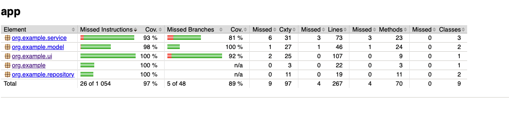

# Library Management System

A simple Java-based Library Management System that allows managing books, members, and borrowing operations via a console interface.


### Build
To build the project:
```bash
./gradlew build
```

### Run
To start the application:
```bash
./gradlew run
```

## Testing and Code Coverage

The project uses **JUnit** for testing and **Mockito** for mocking dependencies.

To run all tests:
```bash
./gradlew test
```

### Code Coverage
We have achieved **97% test coverage**!



You can generate the coverage report locally:
```bash
./gradlew jacocoTestReport
```
The report will be available at: `app/build/reports/jacoco/test/html/index.html`
